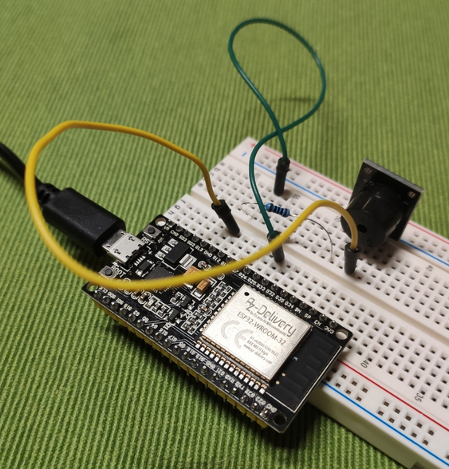

# Kimmunicator Ringtone on ESP32

Educational demo for playing tones on a buzzer via ESP32.
Really nothing special.

## Parts

* ESP32 Dev Kit
* Active or passive buzzer
* Wires

## Construction

1.  Hook up any GPIO to the positive end of the buzzer.
    * Some like putting a resistor in between, but whatever.
    * 100 Ohm is probably fine if you care.
2.  Hook up ground.

## Usage

1.  Press the reset button to play the ringtone.